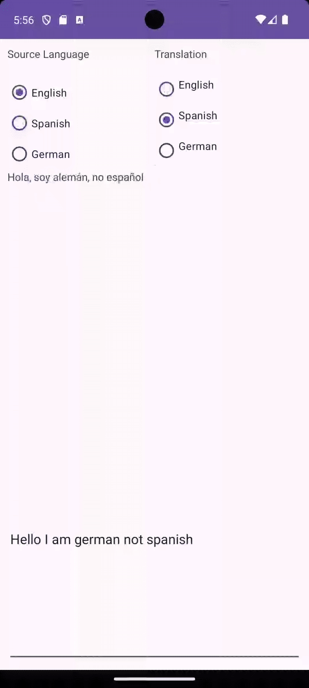

# C323 Project 5

This is a language translation app for an Android Device. 
It automatically starts off with English to English and the user can input any text to the edit text box.
Upon typing or changing the Radio buttons it will also automatically translate the text.

## Functionality 

The following **required** functionality is completed:

* [ ] User can select the type of language for input and out such as English, Spanish, and German
* [ ] The User gets the correct output language and it is translated
* [ ] The application uses a view model
* [ ] The application uses ML Kit

The following **extensions** are implemented:

* ...
* ...

## Video Walkthrough

Here's a walkthrough of implemented user stories:

## Notes

Getting the ML Kit to fully translate was hard as it had a lot of extra checks and conditions before working.

## License

    Copyright [2023] [Kevin Schoonover]

    Licensed under the Apache License, Version 2.0 (the "License");
    you may not use this file except in compliance with the License.
    You may obtain a copy of the License at

        http://www.apache.org/licenses/LICENSE-2.0

    Unless required by applicable law or agreed to in writing, software
    distributed under the License is distributed on an "AS IS" BASIS,
    WITHOUT WARRANTIES OR CONDITIONS OF ANY KIND, either express or implied.
    See the License for the specific language governing permissions and
    limitations under the License.
